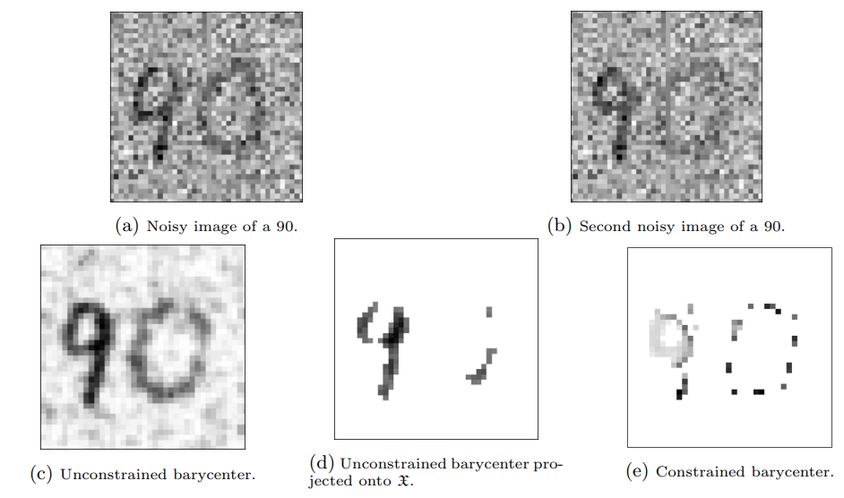
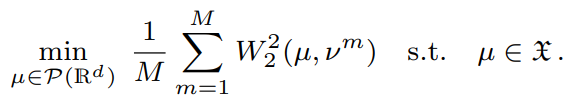
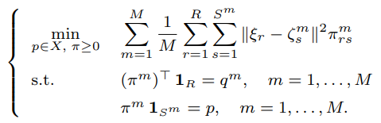
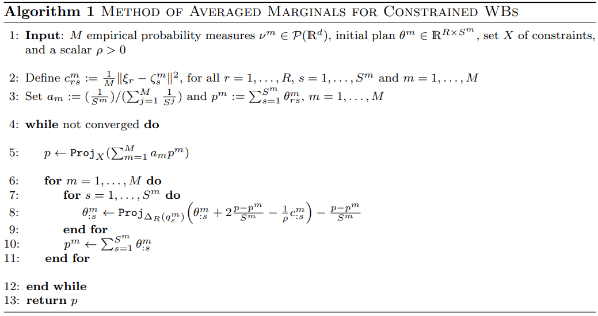
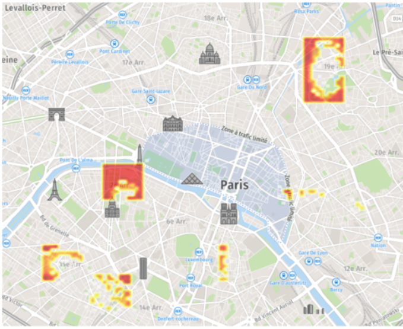

# Constrained Wasserstein barycenter
## 🧭 Optimal Transport Extensions

This repository extends the Method of Averaged Marginals (MAM) to compute **constrained Wasserstein barycenters**, based on:

**Mimouni, D., de Oliveira, W., Sempere, G. M. (2025)**  
*"On the Computation of Constrained Wasserstein Barycenters"*, arXiv ([dan-mim.github.io](https://dan-mim.github.io/files/constrained_Wasserstein.pdf))

⚙️ This includes:
- A **Cmam** package with the function `MAM()` to compute barycenters under convex constraints -- if your constraint is not convex it also works but MAM becomes an heuristic.
- A working example in `localization_pb/` implementing projection onto a feasible set (`project_onto_stock`) exactly like **Algorithm 1** from the article.
- A research prototype in `sparse_MAMLasso/` for ℓ₁-constrained barycenters (not fully developed, but available for inspiration).

Below is an example on how the constraint can be used to denoise images. In image (e) the constrained is on the number of elements in the support of the barycenter, while (d) tries a direct denoising technique after the computation of the barycenter.

<p align="center">
  
</p>

---

## 📦 Installation

```bash
git clone https://github.com/dan-mim/Optimal_Transport_Extensions.git
cd Optimal_Transport_Extensions
pip install -r requirements.txt
```

You may optionally create a Conda environment:

```bash
conda create -n ot_ext python=3.10
conda activate ot_ext
pip install -r requirements.txt
```

---

## 🧠 Algorithm Overview

We extend the classic MAM via **Douglas–Rachford splitting** to solve the constrained problem:

<p align="center">
  
</p>


By discretizing and fixing support, it becomes:

<p align="center">
  
</p>


**Algorithm 1: Constrained MAM (Douglas–Rachford)**  

<p align="center">
  
</p>


- The *projection onto Bx* enforces marginals average into the convex constraint set *X*.
- Matches **Algorithm 1** exactly as implemented in `Cmam/utils/project_onto_stock.py`.

---

## 📁 Repository Structure

```
Optimal_Transport_Extensions/
├── Cmam/
│   ├── __init__.py           
│   ├── solver.py             # core constrained MAM implementation
│   └── utils/
│       └── project_onto_stock.py
├── localization_pb/          # transport + projection demo
├── sparse_MAMLasso/          # research prototype (ℓ₁ constraints)
├── requirements.txt
└── README.md
```

---

## ▶️ Usage

### 🔹 Example: Localization with stock constraint

```bash
cd localization_pb
python demo_localization.py
```

This demo loads input distributions, applies MAM(..., constraint=project_onto_stock), and visualizes the resulting constrained barycenter in a classical storage localization problem — where the goal is to determine optimal warehouse locations for goods, balancing both rental costs and transportation expenses.

<p align="center">
  
</p>

### 🔹 ℓ₁-constrained extension

Explore `sparse_MAMLasso/` to see how to add ℓ₁ (sparse) constraints to MAM — work in progress, but a great starting point.

---

## 📘 Citations & Acknowledgements

Primary reference:

```bibtex
@article{mimouni2025constrained,
  title={On the Computation of Constrained Wasserstein Barycenters},
  author={Mimouni, Daniel and de Oliveira, Welington and Sempere, Gregorio M.},
  journal={arXiv preprint arXiv:xxxx.xxxxx},
  year={2025}
}
```

Original MAM paper:

```bibtex
@article{mimouni2024computing,
  title={Computing Wasserstein Barycenter via Operator Splitting: The Method of Averaged Marginals},
  author={Mimouni, Daniel et al.},
  journal={SIAM Journal on Mathematics of Data Science},
  volume={6},
  number={4},
  pages={1000–1026},
  year={2024}
}
```

---

## ✨ Contribution & Exploration

- Feel free to extend MAM to non-convex constraints or [GAN-based priors](https://github.com/dan-mim/wasserstein-morphing-mamGAN).
- Use `project_onto_stock` as template.
- Pull requests and discussions are welcome — especially for applications in imaging, scenario tree reduction, or structure-constrained OT.
